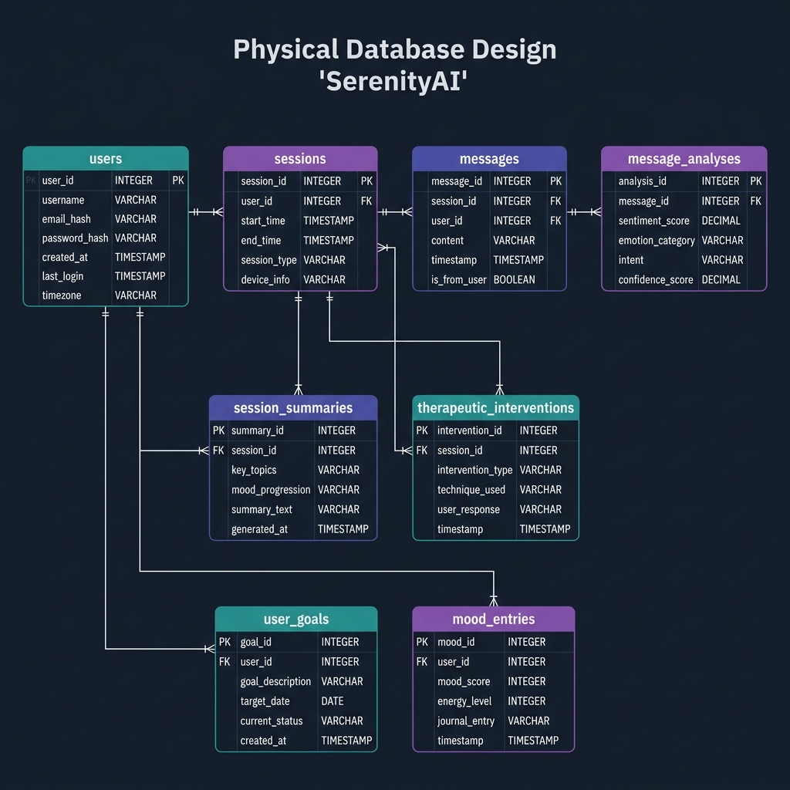
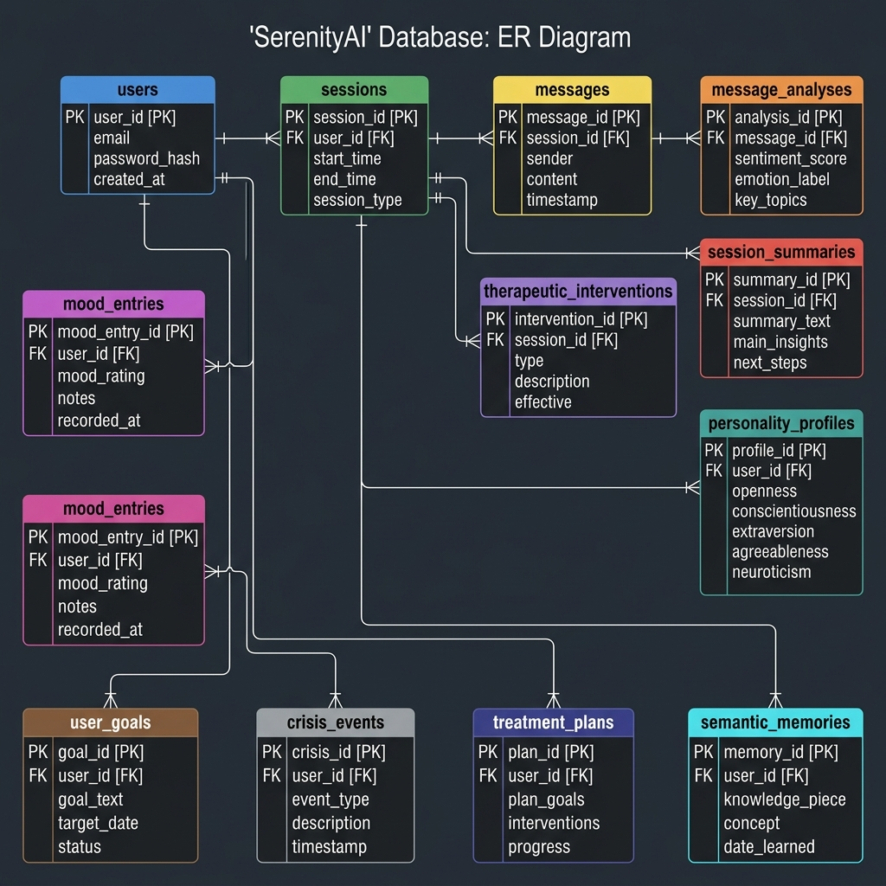
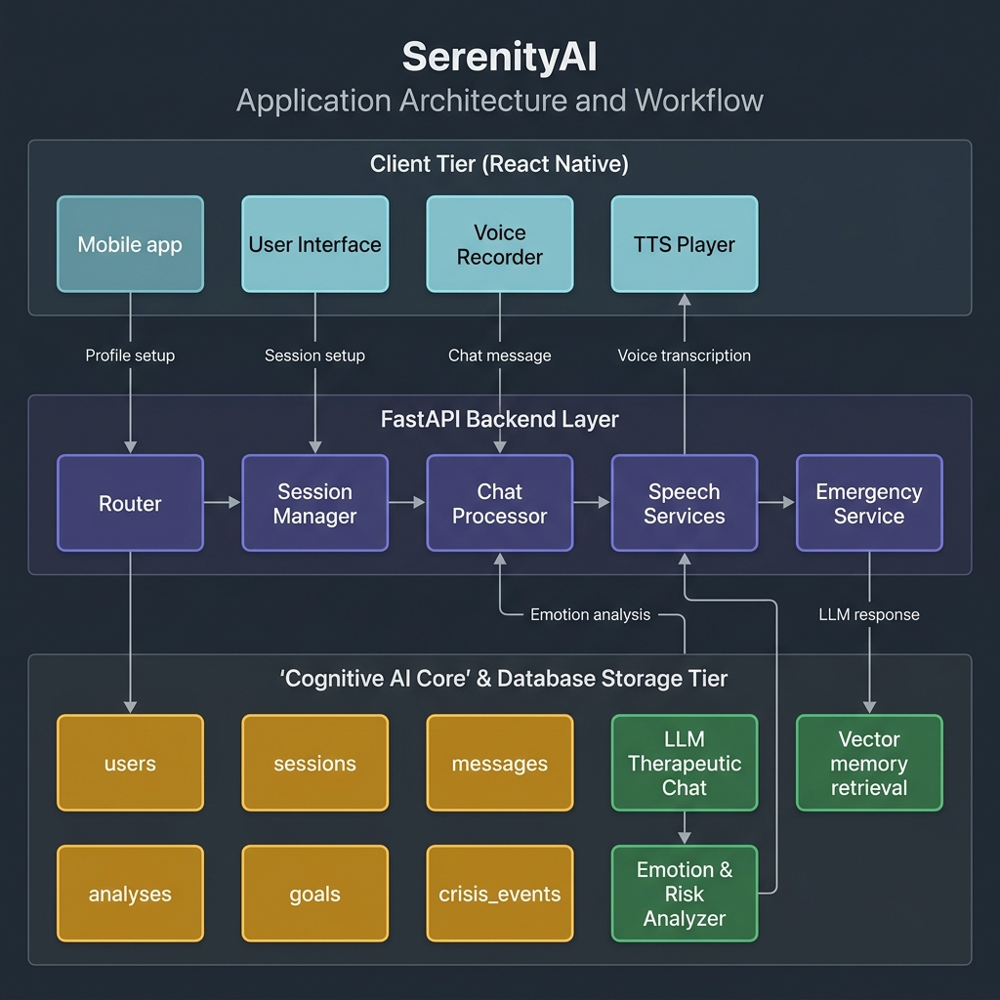

# SerenityAI System Documentation, Diagrams & Workflows

This folder contains the complete architectural blueprints, database design models, and system workflow documentation for **SerenityAI**.

---

## 📂 Contents
1. [Physical Database Design Diagram](#-physical-database-design-diagram)
2. [Entity-Relationship (ER) Diagram](#-entity-relationship-er-diagram)
3. [Application Workflow Diagram](#-application-workflow-diagram)
4. [Detailed Schema Definitions](#-detailed-schema-definitions)
5. [Step-by-Step System Workflows](#-step-by-step-system-workflows)

---

## 💾 Physical Database Design Diagram

### Symmetrical Schema Grid Representation
Below is the physical database design diagram showing the schema layout, tables, primary/foreign keys, and data types mapped in a balanced, professional grid.



---

## 📊 Entity-Relationship (ER) Diagram

### Realistic ER Diagram Representation
Below is the logical ER Diagram displaying the entities, their properties, keys, and connections.



### ER Diagram (Mermaid Source)
If your editor supports Mermaid previewing, or if you use a tool like [Mermaid Live Editor](https://mermaid.live), you can view and edit the diagram using the code below. The source file is also available at [er_diagram.mermaid](er_diagram.mermaid).

```mermaid
erDiagram
    users {
        int id PK
        string firebase_uid UK "Unique Firebase User ID"
        string email UK
        string name
        datetime dob
        string gender
        float lat
        float lng
        string emergency_name
        string emergency_phone
        string emergency_email
        string phone
        string path
    }

    sessions {
        int id PK
        string user_uid FK "References users.firebase_uid"
        string mood
        string path
        datetime created_at
        int duration_seconds
        string current_phase
        boolean is_ended
        boolean is_crisis_active
    }

    messages {
        int id PK
        int session_id FK "References sessions.id"
        string role
        text content
        string audio_url
        datetime timestamp
    }

    session_summaries {
        int id PK
        int session_id FK "References sessions.id (Unique)"
        string user_uid FK "References users.firebase_uid"
        text summary_data
        datetime created_at
    }

    message_analyses {
        int id PK
        int message_id FK "References messages.id (Unique)"
        string primary_emotion
        string secondary_emotion
        int emotion_intensity
        string stress_level
        string emotional_need
        string conversation_need
        string risk_level
        string risk_details
        int urgency_score
        string selected_strategy
        datetime created_at
    }

    therapeutic_interventions {
        int id PK
        int session_id FK "References sessions.id"
        string user_uid FK "References users.firebase_uid"
        string intervention_type
        string status
        text data
        datetime created_at
        datetime updated_at
    }

    user_goals {
        int id PK
        string user_uid FK "References users.firebase_uid"
        text goal
        string category
        int progress
        string status
        datetime created_at
        datetime updated_at
    }

    session_reflections {
        int id PK
        int session_id FK "References sessions.id (Unique)"
        string user_uid FK "References users.firebase_uid"
        text breakthroughs
        text homework
        string homework_status
        text next_session_focus
        int confidence_level
        datetime created_at
    }

    mood_entries {
        int id PK
        int session_id FK "References sessions.id"
        string user_uid FK "References users.firebase_uid"
        int mood_score
        int anxiety_score
        int stress_score
        int energy_score
        int confidence_score
        datetime created_at
    }

    personality_profiles {
        int id PK
        string user_uid FK "References users.firebase_uid (Unique)"
        float analytical
        float emotional
        float action_oriented
        float reflective
        float avoidant
        float social
        float introverted
        float extroverted
        text confidence_data
        datetime updated_at
    }

    crisis_events {
        int id PK
        int session_id FK "References sessions.id"
        string user_uid FK "References users.firebase_uid"
        int trigger_message_id FK "References messages.id (Nullable)"
        int urgency_score
        text crisis_details
        text action_taken
        datetime created_at
    }

    treatment_plans {
        int id PK
        string user_uid FK "References users.firebase_uid"
        string focus_area
        text milestones
        int progress
        string completion_status
        datetime created_at
        datetime updated_at
    }

    semantic_memories_db {
        string id PK
        string user_uid FK "References users.firebase_uid"
        text content
        string memory_type
        int session_id "Nullable"
        int importance
        text vector_data
        datetime created_at
    }

    continuous_learning_data {
        int id PK
        text user_input
        string context_path
        text generated_strategy
        boolean is_processed
        datetime created_at
    }

    users ||--o{ sessions : "starts"
    users ||--|| personality_profiles : "has"
    users ||--o{ user_goals : "pursues"
    users ||--o{ treatment_plans : "follows"
    users ||--o{ semantic_memories_db : "retains"
    users ||--o{ session_summaries : "receives"
    users ||--o{ therapeutic_interventions : "undergoes"
    users ||--o{ session_reflections : "reflects on"
    users ||--o{ mood_entries : "logs"
    users ||--o{ crisis_events : "experiences"

    sessions ||--o{ messages : "contains"
    sessions ||--|| session_summaries : "summarized_by"
    sessions ||--|| session_reflections : "concludes_with"
    sessions ||--o{ mood_entries : "associated_with"
    sessions ||--o{ crisis_events : "flags"
    sessions ||--o{ therapeutic_interventions : "conducts"

    messages ||--|| message_analyses : "analyzed_by"
    messages ||--o| crisis_events : "triggers"
```



---

## 🔄 Application Workflow Diagram

### Realistic Workflow Diagram Representation
Below is the generated Application Workflow Diagram displaying the client-server interactions, data pipelines, AI models, and escalations.



### Workflow Diagram (Mermaid Source)
The workflow code below is also available in [workflow_diagram.mermaid](workflow_diagram.mermaid).

```mermaid
graph TD
    %% Styling and Theme
    classDef client fill:#1E293B,stroke:#0EA5E9,stroke-width:2px,color:#F8FAFC;
    classDef backend fill:#1E293B,stroke:#8B5CF6,stroke-width:2px,color:#F8FAFC;
    classDef ai fill:#1E293B,stroke:#10B981,stroke-width:2px,color:#F8FAFC;
    classDef db fill:#1E293B,stroke:#F59E0B,stroke-width:2px,color:#F8FAFC;
    classDef crisis fill:#7F1D1D,stroke:#EF4444,stroke-width:2px,color:#FEE2E2;

    %% Nodes Definitions
    subgraph Client ["📱 Client Tier (React Native / Expo)"]
        UserApp["Mobile Application User Interface"]:::client
        AudioRec["Voice Recorder (Audio Input)"]:::client
        AudioPlayer["TTS Player (Audio Output)"]:::client
    end

    subgraph API ["⚡ FastAPI Backend Layer"]
        Router["FastAPI Router Gateway"]:::backend
        AuthValidate["Firebase Auth & Token Validator"]:::backend
        SessionMgr["Session Lifecycle Manager"]:::backend
        ChatEngine["Chat & Core Processing Orchestrator"]:::backend
        SpeechEngine["Speech Processor (Whisper & Edge-TTS)"]:::backend
        EmergencySvc["Emergency Alert System (Twilio & Email)"]:::backend
    end

    subgraph AI_Core ["🧠 Cognitive & AI Core"]
        LLMChat["Groq / Gemini LLM (Therapeutic Response)"]:::ai
        EmotionAnalyzer["Emotion & Risk Analyzer"]:::ai
        SemanticMem["Semantic Vector Memory Matcher"]:::ai
    end

    subgraph Storage ["💾 Storage & Data Tier"]
        PostgresDB[("PostgreSQL Database<br>(SQLAlchemy ORM)")]:::db
        UserTable[("users")]:::db
        SessionTable[("sessions")]:::db
        MsgTable[("messages")]:::db
        AnalysisTable[("message_analyses")]:::db
        CrisisTable[("crisis_events")]:::db
        GoalTable[("user_goals")]:::db
        PlanTable[("treatment_plans")]:::db
    end

    %% Workflow Connections
    
    %% User authentication & Session creation
    UserApp -->|1. Authenticate / Setup Profile| Router
    Router --> AuthValidate
    AuthValidate -->|Validate UID| UserTable
    
    UserApp -->|2. Start Session| Router
    Router --> SessionMgr
    SessionMgr -->|Initialize Session Record| SessionTable

    %% Message Flow (Voice and Text)
    UserApp -->|3a. Send Text Message| Router
    AudioRec -->|3b. Send Voice Message (.wav/.mp3)| Router
    
    Router -->|If Text| ChatEngine
    Router -->|If Voice| SpeechEngine
    SpeechEngine -->|Transcribe (Speech-To-Text)| ChatEngine
    
    %% Core chat processing
    ChatEngine -->|Retrieve User Context & Memories| SemanticMem
    SemanticMem -->|Semantic Query| PostgresDB
    
    ChatEngine -->|Analyze Message Sentiment & Risk| EmotionAnalyzer
    EmotionAnalyzer -->|Analyze Emotion & Risk Level| LLMChat
    EmotionAnalyzer -->|Save Metrics| AnalysisTable
    
    %% Crisis Detection Routing
    EmotionAnalyzer -->|Risk Level == High| EmergencySvc
    EmergencySvc -->|Trigger Crisis Protocol & Log Event| CrisisTable:::crisis
    EmergencySvc -->|Send Alert to Emergency Contact| ContactPhone["Emergency Contact Email/Phone"]:::crisis
    
    %% Response Synthesis
    LLMChat -->|Synthesize Response Strategy| ChatEngine
    ChatEngine -->|Save Assistant Message| MsgTable
    
    ChatEngine -->|If Voice Session: Generate Audio| SpeechEngine
    SpeechEngine -->|Synthesize Audio (TTS)| AudioPlayer
    ChatEngine -->|Return Text Response| UserApp
    
    %% Session ending
    UserApp -->|4. End Session| Router
    Router --> SessionMgr
    SessionMgr -->|Calculate Metrics, Summarize & Generate Reflections| SessionTable
    SessionMgr -->|Save Goal Updates| GoalTable
    SessionMgr -->|Save Treatment Milestone Progress| PlanTable
```

---

## 💾 Detailed Schema Definitions

### 1. `users`
Represents the registered application users. Authentication keys off Firebase UID, which is also used as a foreign key identifier throughout the database.

| Column | Type | Constraints | Description |
| :--- | :--- | :--- | :--- |
| `id` | Integer | PK, Auto-increment | Internal surrogate key. |
| `firebase_uid` | String | Unique, Indexed | The user's unique Firebase authentication identifier. |
| `email` | String | Unique | User's login email address. |
| `name` | String | - | User's display name. |
| `dob` | DateTime | Nullable | User's date of birth. |
| `gender` | String | Nullable | User's gender. |
| `lat` | Float | Nullable | Last known latitude. |
| `lng` | Float | Nullable | Last known longitude. |
| `emergency_name` | String | Nullable | Emergency contact person name. |
| `emergency_phone` | String | Nullable | Emergency contact phone number. |
| `emergency_email` | String | Nullable | Emergency contact email address. |
| `phone` | String | Nullable | User's phone number. |
| `path` | String | Nullable | File path related to user details or avatar. |

### 2. `sessions`
Represents therapeutic conversation sessions started by users.

| Column | Type | Constraints | Description |
| :--- | :--- | :--- | :--- |
| `id` | Integer | PK | Session ID. |
| `user_uid` | String | FK -> `users.firebase_uid` | UID of the user who owns this session. |
| `mood` | String | - | User's mood at the start/during the session. |
| `path` | String | - | Navigation path or context identifier. |
| `created_at` | DateTime | Default: UTC Now | Timestamp when the session was created. |
| `duration_seconds` | Integer | Default: 0 | Total duration of the session in seconds. |
| `current_phase` | String | Default: 'rapport_building' | Phase of therapy (e.g., rapport_building, exploration, intervention). |
| `is_ended` | Boolean | Default: False | Flag indicating whether the session has finished. |
| `is_crisis_active` | Boolean | Default: False | Flag indicating if a crisis protocol is currently active in this session. |

### 3. `messages`
Stores individual chat messages exchanged between the user and the AI assistant during a session.

| Column | Type | Constraints | Description |
| :--- | :--- | :--- | :--- |
| `id` | Integer | PK | Message ID. |
| `session_id` | Integer | FK -> `sessions.id` | The session this message belongs to. |
| `role` | String | - | Message sender role ('user', 'assistant', 'system'). |
| `content` | Text | - | Text content of the message. |
| `audio_url` | String | Nullable | Link to stored voice recording if input/output was audio. |
| `timestamp` | DateTime | Default: UTC Now | Timestamp when the message was sent. |

### 4. `session_summaries`
Maintains encrypted summaries of the therapeutic sessions.

| Column | Type | Constraints | Description |
| :--- | :--- | :--- | :--- |
| `id` | Integer | PK | Summary ID. |
| `session_id` | Integer | FK -> `sessions.id`, Unique | One-to-one link to the session. |
| `user_uid` | String | FK -> `users.firebase_uid` | Owner of the session. |
| `summary_data` | Text | - | Encrypted JSON containing main_issues, triggers, emotional patterns, etc. |
| `created_at` | DateTime | Default: UTC Now | Timestamp when the summary was generated. |

### 5. `message_analyses`
Holds detailed emotional, psychological, and risk analysis metrics computed for user messages.

| Column | Type | Constraints | Description |
| :--- | :--- | :--- | :--- |
| `id` | Integer | PK | Analysis ID. |
| `message_id` | Integer | FK -> `messages.id`, Unique | One-to-one link to the message analyzed. |
| `primary_emotion` | String | - | Primary emotion detected (e.g., Sadness, Anger, Joy). |
| `secondary_emotion` | String | - | Secondary supporting emotion. |
| `emotion_intensity` | Integer | - | Numeric scale of emotion intensity. |
| `stress_level` | String | - | Evaluated stress level (low, moderate, high). |
| `emotional_need` | String | - | Identified underlying emotional need. |
| `conversation_need` | String | Nullable | Conversational requirement/intent of the user. |
| `risk_level` | String | - | Suicide/self-harm risk level classification. |
| `risk_details` | String | Nullable | Explanatory context about any identified risk. |
| `urgency_score` | Integer | Default: 1 | Numeric score indicating response priority (higher = more urgent). |
| `selected_strategy` | String | - | Selected AI therapeutic strategy. |
| `created_at` | DateTime | Default: UTC Now | Analysis creation timestamp. |

### 6. `therapeutic_interventions`
Tracks cognitive behavioral therapy (CBT) or other therapeutic interventions initiated within a session.

| Column | Type | Constraints | Description |
| :--- | :--- | :--- | :--- |
| `id` | Integer | PK | Intervention ID. |
| `session_id` | Integer | FK -> `sessions.id` | Session during which the intervention was deployed. |
| `user_uid` | String | FK -> `users.firebase_uid` | Target user. |
| `intervention_type` | String | - | Classification of intervention (e.g., CBT Reframing, Mindfulness). |
| `status` | String | - | State of the intervention (initiated, in_progress, completed). |
| `data` | Text | Nullable | Encrypted JSON detailing state variables, exercises, or user responses. |
| `created_at` | DateTime | Default: UTC Now | Creation timestamp. |
| `updated_at` | DateTime | Default: UTC Now | Updates on status modification. |

### 7. `user_goals`
Active goals created, tracked, and worked on by the user.

| Column | Type | Constraints | Description |
| :--- | :--- | :--- | :--- |
| `id` | Integer | PK | Goal ID. |
| `user_uid` | String | FK -> `users.firebase_uid` | Owner of the goal. |
| `goal` | Text | - | Description of what the user wants to achieve. |
| `category` | String | - | Domain (e.g., Health, Work, Relationships, Self-Care). |
| `progress` | Integer | Default: 0 | Completion percentage (0-100). |
| `status` | String | Default: "active" | Goal lifecycle state (active, completed, discarded). |
| `created_at` | DateTime | Default: UTC Now | Creation timestamp. |
| `updated_at` | DateTime | Default: UTC Now | Updates on progress modification. |

### 8. `session_reflections`
Formulates end-of-session cognitive insights, homework assignments, and self-reflection details.

| Column | Type | Constraints | Description |
| :--- | :--- | :--- | :--- |
| `id` | Integer | PK | Reflection ID. |
| `session_id` | Integer | FK -> `sessions.id`, Unique | One-to-one relation to session. |
| `user_uid` | String | FK -> `users.firebase_uid` | Owner. |
| `breakthroughs` | Text | Nullable | Major realizations or breakthroughs noted. |
| `homework` | Text | Nullable | Suggested exercise or reading for the user before the next session. |
| `homework_status` | String | Default: "pending" | Lifecycle status of task (pending, completed, skipped). |
| `next_session_focus` | Text | Nullable | Targeted discussion area for the subsequent session. |
| `confidence_level` | Integer | Nullable | Client's reported confidence rating. |
| `created_at` | DateTime | Default: UTC Now | Date of entry. |

### 9. `mood_entries`
Consolidated tracker logs recording numeric wellness metrics.

| Column | Type | Constraints | Description |
| :--- | :--- | :--- | :--- |
| `id` | Integer | PK | Entry ID. |
| `session_id` | Integer | FK -> `sessions.id` | Session during which the mood was logged. |
| `user_uid` | String | FK -> `users.firebase_uid` | User. |
| `mood_score` | Integer | - | Rating of general mood. |
| `anxiety_score` | Integer | - | Rating of anxiety levels. |
| `stress_score` | Integer | - | Rating of stress. |
| `energy_score` | Integer | - | Rating of physical/mental energy. |
| `confidence_score` | Integer | - | Rating of self-confidence. |
| `created_at` | DateTime | Default: UTC Now | Log timestamp. |

### 10. `personality_profiles`
Maintains a dynamic behavioral, reflective, and emotional profile score (Float range 0.0 - 1.0) derived by AI analysis.

| Column | Type | Constraints | Description |
| :--- | :--- | :--- | :--- |
| `id` | Integer | PK | Profile ID. |
| `user_uid` | String | FK -> `users.firebase_uid`, Unique | One-to-one profile link per user. |
| `analytical` | Float | Default: 0.5 | Analytical trait rating. |
| `emotional` | Float | Default: 0.5 | Emotional trait rating. |
| `action_oriented` | Float | Default: 0.5 | Action-oriented rating. |
| `reflective` | Float | Default: 0.5 | Reflective rating. |
| `avoidant` | Float | Default: 0.5 | Avoidant traits rating. |
| `social` | Float | Default: 0.5 | Social interaction score. |
| `introverted` | Float | Default: 0.5 | Introvert score. |
| `extroverted` | Float | Default: 0.5 | Extrovert score. |
| `confidence_data` | Text | Nullable | JSON object detailing rating confidence levels. |
| `updated_at` | DateTime | Default: UTC Now | Timestamp of last refinement. |

### 11. `crisis_events`
Maintains permanent audit and escalation records for self-harm or psychiatric crisis flags.

| Column | Type | Constraints | Description |
| :--- | :--- | :--- | :--- |
| `id` | Integer | PK | Event ID. |
| `session_id` | Integer | FK -> `sessions.id` | Session in which crisis occurred. |
| `user_uid` | String | FK -> `users.firebase_uid` | User affected. |
| `trigger_message_id` | Integer | FK -> `messages.id`, Nullable | Specific message that flagged safety thresholds. |
| `urgency_score` | Integer | - | Urgency ranking of the crisis event. |
| `crisis_details` | Text | Nullable | Detailed safety logging context. |
| `action_taken` | Text | Nullable | Mitigation actions taken (e.g., sent emergency email, prompt resource display). |
| `created_at` | DateTime | Default: UTC Now | Event timestamp. |

### 12. `treatment_plans`
Curated therapeutic plans, broken down into target areas and milestones.

| Column | Type | Constraints | Description |
| :--- | :--- | :--- | :--- |
| `id` | Integer | PK | Plan ID. |
| `user_uid` | String | FK -> `users.firebase_uid` | Owner of this plan. |
| `focus_area` | String | - | Subject matter area (e.g., Anxiety management, CBT for insomnia). |
| `milestones` | Text | Nullable | JSON-serialized milestones list. |
| `progress` | Integer | Default: 0 | Overall progress percentage. |
| `completion_status` | String | Default: "active" | Plan status (active, completed, paused). |
| `created_at` | DateTime | Default: UTC Now | Creation timestamp. |
| `updated_at` | DateTime | Default: UTC Now | Updates when milestone progress shifts. |

### 13. `semantic_memories_db`
High-dimensional semantic knowledge graphs and facts about the user. Used for context injection and retrieval.

| Column | Type | Constraints | Description |
| :--- | :--- | :--- | :--- |
| `id` | String | PK | Unique hash/UUID of memory. |
| `user_uid` | String | FK -> `users.firebase_uid` | Owner. |
| `content` | Text | - | Raw text of fact or memory. |
| `memory_type` | String | - | Memory category (e.g., relationship, career, preference). |
| `session_id` | Integer | Nullable | Origin session. |
| `importance` | Integer | Default: 5 | Rating weight of the memory (1-10 scale). |
| `vector_data` | Text | - | Serialized JSON representation of high-dimensional embedding vector. |
| `created_at` | DateTime | Default: UTC Now | Entry date. |

### 14. `continuous_learning_data`
Tracks anonymous feedback and interactions to adjust prompt pipelines, training models, and heuristics.

| Column | Type | Constraints | Description |
| :--- | :--- | :--- | :--- |
| `id` | Integer | PK | Primary learning index. |
| `user_input` | Text | - | Message or snippet. |
| `context_path` | String | - | Navigation path or context state. |
| `generated_strategy` | Text | - | System action. |
| `is_processed` | Boolean | Default: False | Has this record been evaluated for prompt fine-tuning. |
| `created_at` | DateTime | Default: UTC Now | Creation timestamp. |

---

## 🏁 Step-by-Step System Workflows

### 1. User Initialization
1. User logs in/registers in the **Expo React Native app**.
2. Client sends credentials to the **FastAPI Gateway**, validating details with Firebase.
3. User fills in onboarding data (DOB, gender, emergency contacts).
4. System creates or completes the `users` record.

### 2. Conversational Session Lifecycle
1. **Start**: The user starts a new session (POST `/api/session/start`). A record is added to the `sessions` table.
2. **Turn Exchange**:
   - The user speaks or types. If speaking, client uploads audio; the backend transcribes it via the **Speech Processor**.
   - The core **Chat Orchestrator** pulls historical user profile and semantic memory details (`semantic_memories_db`) to inject contextual background.
   - The **Emotion & Risk Analyzer** assesses the message in real-time. Sentiment and risk scores are saved in the `message_analyses` table.
   - The LLM processes the message based on the clinical strategy, generates a response, and stores it in the `messages` table.
   - If the session uses audio, **Edge-TTS** synthesizes a voice response.
3. **Escalation (Crisis Guardrails)**:
   - If a suicide or self-harm risk is flagged by the analyzer, the **Emergency Alert System** triggers.
   - It fires off warning emails/alerts to the registered `emergency_email`/`emergency_phone` contact and locks the session state with an active crisis status (`is_crisis_active` = `True`).
4. **End**: The user terminates the session (POST `/api/session/end/{session_id}`).
   - The system aggregates the session stats (e.g., duration).
   - Generates a clinical summary (`session_summaries` table).
   - Forms breakthroughs, logs cognitive reflections, and assigns homework tasks (`session_reflections` table).
   - Logs overall mood metrics (`mood_entries` table).
