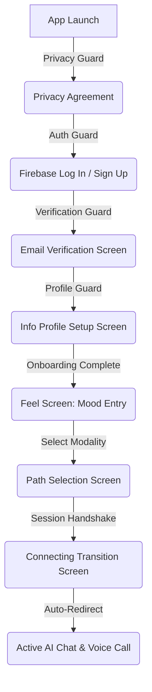
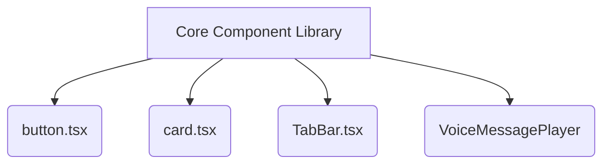
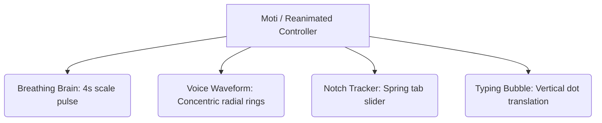

# SERENITY AI (DONNA AI)
## UI/UX Detail Design Document
**BS Computer Science — Final Year Project (FYP) Report Section**

---

## 1. Introduction to the UI/UX Design

### 1.1 Purpose of the Interface
The primary objective of the Serenity AI (Donna AI) user interface is to establish a secure, therapeutic, and friction-free digital sanctuary for individuals dealing with mental health challenges such as anxiety, stress, loneliness, academic pressure, and overthinking. Unlike conventional utility apps, a mental health companion interface must serve as an active participant in the therapeutic process. 

Every visual asset, layout choice, and transition curve is engineered to lower cortisol levels, diminish decision fatigue, and build interpersonal trust between the user and the AI companion, Donna. The interface acts as a mediator, transitioning the user from a state of emotional distress to a grounded, reflective state of mind.

### 1.2 Design Philosophy: "The Digital Sanctuary"
The core design philosophy is built upon the concept of a **"Digital Sanctuary"**. This philosophy is implemented through three core tenets:
1. **Safety and Solitude:** The interface must feel private. There are no distracting social feeds, gamified leaderboards, or noisy notifications. The visual boundaries are clean, soft, and protective.
2. **Organic Fluidity:** Mental distress is often characterized by rigid, repetitive, or chaotic thoughts. The UI counteracts this by utilizing soft, organic gradients, continuous breathing animations, and liquid-like transitions that mimic natural rhythms (such as breathing cycles).
3. **Egalitarian Interaction:** Donna is presented not as an authority figure, but as an empathetic peer. The design reflects this by using approachable iconography, clear conversational messaging bubbles, and a warm, human-like voice conversation overlay.

### 1.3 Overall User Experience (UX) Goals
The success of Serenity AI is measured by the emotional state of the user before, during, and after an interaction. The UX framework is optimized to achieve the following specific goals:
* **Immediate Cortisol Reduction:** Visually soothing colors and micro-animations begin lowering stress levels from the moment the custom splash screen appears.
* **Zero-Friction Entry:** A robust navigation guard system handles authentication, verification, and onboarding in a simple, step-by-step wizard format to prevent cognitive overload.
* **Empathetic Presence:** Through interactive waveforms, real-time subtitles, and pitch-adapted TTS, the user feels active engagement and deep listening.
* **Progress Visibility:** Relational data summaries and the clinical PDF report generation engine empower users by making their emotional progress visible and shareable.

---

## 2. UI/UX Design Strategy

### 2.1 Minimalistic Approach
Cognitive overload is a major trigger for anxiety and distress. The user interface enforces a strict minimalist layout policy:
* **Single Focus Layouts:** Each screen features exactly one primary call-to-action (CTA). For example, the `Feel` check-in screen isolates the mood selection cards from the text input area, preventing visual competition.
* **Whitespace as a Visual Buffer:** Generous margins (`px-6` and `px-8` representing 24px and 32px paddings) ensure that textual content and interactive controls are surrounded by negative space, allowing the user's eyes to rest.
* **Flat and Semi-Translucent Materials:** The UI makes extensive use of Glassmorphism (semi-translucent white cards overlaying the background gradient), which reduces visual noise while maintaining depth.

### 2.2 Modern Design Language (Glassmorphism)
The visual theme utilizes a premium glassmorphic aesthetic to create an ethereal, light-filled, and clean atmosphere:
* **Translucent Backdrops:** Components like the `SupportCard` and the core `Feel` container use `backgroundColor: "rgba(255, 255, 255, 0.22)"` with thin white borders (`borderColor: "rgba(255, 255, 255, 0.35)"`).
* **Soft Shadows:** Elevation is established using low-spread, high-blur drop shadows (`shadowColor: "#0F172A"`, `shadowOpacity: 0.15`, `shadowRadius: 28`) rather than harsh solid borders. This makes the interface feel light, gentle, and modern.
* **Blur and Depth:** Visual elements float over a dynamic three-color ambient gradient background, giving the illusion of soft, shifting light in a calm atmosphere.

### 2.3 Gen-Z Friendly Interface
As the primary target audience, the interface incorporates design elements that resonate with young adults and Gen-Z:
* **Iconographic Expression:** Rather than dry, clinical terms, emotions are represented using universally recognized emojis (`😰`, `😔`, `😡`, `🥱`, `🥺`, `😐`) designed into large, responsive touch targets.
* **Conversational Copywriting:** The text throughout the application avoids clinical jargon. Labels like *"Or, express exactly what's on your mind..."* and *"Hello, I'm Donna. I'm here to listen without judgment"* frame the AI as a companion rather than a diagnostic tool.
* **Instant Interactive Loops:** Support for swipe gestures, tap-to-record voice buttons, and immediate haptic/visual feedback matches the expectations of modern app users.

### 2.4 Calm and Distraction-Free Experience
To maintain a therapeutic workspace, the following elements are intentionally excluded:
* No advertisements or commercial banners.
* No notifications reminding the user they are falling behind on streaks.
* No gamification badges that might induce performance anxiety.
* No dark patterns (e.g., hidden settings, complex cancellation flows).
* A solid white background option (`#F8FAFC`) automatically activates on high-focus screens (Chat, History, Profile) to completely eliminate visual distractions.

---

## 3. UX Design Strategy & Accessibility

### 3.1 User-Centered Design (UCD)
The design process followed an iterative user-centered lifecycle. User research highlighted that individuals in high-stress states cannot parse complex nested menus. Therefore, the interface utilizes a flat navigation architecture. Any primary action (starting a chat, checking history, editing emergency contacts) is reachable within a maximum of **two taps** from the home hub.



### 3.2 Ease of Navigation
The navigation strategy uses React Native's Expo Router to enforce clean stack states:
* **The "Traffic Controller" Layout:** The root `_layout.tsx` checks auth states, email verification, and profile completion dynamically, routing the user to the correct screen.
* **Custom Concave Bottom TabBar:** A highly customized navigation bar is anchored to the bottom of the viewport. It features an SVG-cut concave notch that frames a floating active slate-black circle. This circle dynamically slides to the active screen, providing a delightful tactile response.

### 3.3 Reduced Cognitive Load
* **Default Values:** Form screens (like profile setup) prepopulate default options (e.g. date of birth defaults to 2000-01-01) to minimize input requirements.
* **Auto-Scrolling Keyboard Responders:** Standard React Native forms often get blocked by the virtual keyboard. Serenity AI implements a custom keyboard-aware layout in `Info.tsx` and `ProfileInfo.tsx`. When a text input is focused, the system calculates its Y-coordinate and automatically scrolls the view (`scrollRef.current?.scrollTo`) to place the input box 40px to 120px above the keyboard. This prevents visual blocking and input frustration.

### 3.4 Accessibility Considerations (A11y)
* **Touch Target Sizing:** All interactive elements (mood selector cards, microphone toggle buttons, navigation items) maintain a minimum touch target area of **48dp x 48dp**, satisfying Android design accessibility guidelines.
* **High Contrast Text:** On dark gradient backgrounds, text is rendered in solid white or high-contrast black/slate-800 to ensure readability for users with mild visual impairments.
* **Voice-First Design:** The application features complete voice equivalence. A user who cannot type can conduct the entire session by speaking. The app handles voice transcription (Whisper V3) and voice synthesis (Edge-TTS) natively.

---

## 4. User Personas & Scenarios

### 4.1 Student Persona: "Zainab Ahmed"
* **Demographics:** 22 years old, BS Computer Science student, Islamabad.
* **Psychographic Profile:** High academic stress, prone to overthinking, struggles with imposter syndrome, experiences insomnia before exams.
* **Pain Points:** Finds traditional therapy expensive and intimidating. Needs immediate, late-night psychological grounding when academic anxiety spikes.
* **Use Case Scenario:** Zainab is studying for her final compiler design exam at 2:00 AM. She feels her chest tighten and cannot focus. She opens Serenity AI, taps the "Anxious" mood, selects the **Logical (CBT)** path, and types: *"I feel like I'm going to fail tomorrow."* Donna guides her through a cognitive restructuring exercise to challenge this negative automatic thought.

### 4.2 Young Adult Persona: "Bilal Khan"
* **Demographics:** 25 years old, Software Engineer, Karachi.
* **Psychographic Profile:** Suffers from mild social anxiety, feelings of isolation after relocating for work, experiences burnout from long screen hours.
* **Pain Points:** Struggles to articulate emotions in writing. Prefers speaking over typing.
* **Use Case Scenario:** Bilal returns home after a stressful day. Feeling isolated, he opens the app, presses the microphone button on the `Feel` screen, and narrates his day. He then initiates a WhatsApp-style voice call. Donna responds with a slow, calming voice, matching Bilal's pace and helping him decompress.

### 4.3 User Journey Map
The following table details the emotional journey of a user interacting with Serenity AI during an anxiety episode:

| Phase | Touchpoint | User Action | Cognitive State | Empathy UX Response |
| :--- | :--- | :--- | :--- | :--- |
| **1. Trigger** | App Icon | Taps app icon on home screen | High anxiety, rapid heartbeat, distracted | Dynamic custom splash screen with a 4-second "Breathing Brain" fade animation. |
| **2. Check-In** | `Feel` Screen | Selects "Anxious" emoji; optionally inputs text or voice | Expressive, seeking recognition | Visual cards scale up on tap; concentric voice pulse rings show active listening. |
| **3. Alignment**| `Path` Screen | Chooses "Logical (CBT)" or "Emotional" | Decisive, looking for structure | Glassmorphic cards with clean icons clarify therapy styles, reducing hesitation. |
| **4. Transition**| `Connecting` | Views screen during backend handshake | Waiting, anxious for response | Displays cyclic affirmations (e.g., *"Take a deep breath. You are safe here."*) and a pulsing heart. |
| **5. Therapeutic**| `Chat` / `Call` | Speaks or types to Donna; listens to voice response | Conversational, self-reflecting | Edge-TTS adjusts rate and pitch. High-contrast bubbles and scrolling transcripts display text. |
| **6. Closure** | Tab Navigation| Views History or Profile | Grounded, relieved | Generates a structured PDF report summarizing sessions for medical or personal tracking. |

---

## 5. Information Architecture & Navigation

The structural organization of Serenity AI relies on a hierarchical structure with clear routing rules. The application separates authentication and onboarding setup from the primary conversational and analytical features.

```
SerenityAI (Root)
│
├── index.tsx ─────────────────► [Renders Privacy Policy]
│
├── (auth)
│   └── auth.tsx ──────────────► [User Login & Account Creation]
│
└── (screens)
    ├── EmailVerify.tsx ───────► [Auto-polling verification block]
    ├── Info.tsx ──────────────► [Initial onboarding profile & map location]
    ├── Feel.tsx ──────────────► [Daily mood entry & voice transcription]
    ├── Path.tsx ──────────────► [Therapeutic modality selection]
    ├── Connecting.tsx ────────► [Handshake loading & quote loop]
    ├── Chat.tsx ──────────────► [Primary chat & WhatsApp-style voice call]
    ├── History.tsx ───────────► [Session log list with snippet deletion]
    ├── Profile.tsx ───────────► [User stats & custom PDF clinical report gen]
    ├── ProfileInfo.tsx ───────► [Editable user fields & reverse geocoding watch]
    └── Settings.tsx ──────────► [Firebase credential update & local complexity validation]
```

### 5.1 Onboarding Navigation Guards
The application implements strict, automated navigation guards in `_layout.tsx` to handle onboarding validation. The logic operates as a sequential pipeline:

```
[Start]
   │
   ├──► Has Accepted Privacy?
   │       ├── NO  ──► Redirect to Privacy Screen ("/")
   │       └── YES ──► Next
   │
   ├──► User Authenticated?
   │       ├── NO  ──► Redirect to Auth Screen ("/(auth)/auth")
   │       └── YES ──► Next
   │
   ├──► Email Verified?
   │       ├── NO  ──► Redirect to Email Verification Screen ("/(screens)/EmailVerify")
   │       └── YES ──► Next
   │
   └──► Profile Complete (isOnboardingComplete)?
           ├── NO  ──► Redirect to Info Setup Screen ("/(screens)/Info")
           └── YES ──► Redirect to Feel Screen ("/(screens)/Feel")
```

This guard design ensures that unverified or incomplete users cannot access therapeutic features, securing the user's data and maintaining the integrity of the clinical database.

---

## 6. Screen-by-Screen UI/UX Analysis

### 6.1 Custom Splash Screen & Launch Flow
* **Purpose:** Acts as a visual transition, cooling down the user's focus and preparing them for a therapeutic experience.
* **Layout & Components:** Features a central rounded app icon, an extra-bold title (`SERENITY AI`), and a custom subtitle container displaying *"Your personal AI therapist"*. A bottom `DotLoader` animates three horizontal dots.
* **Micro-interactions:** A spring entry scales the icon up, followed by a vertical translation fade-in for the text. If a network connectivity failure is detected, the loader replaces itself with an elegant warning box and a "Retry Connection" button.
* **Design & UX Decisions:** The layout bypasses native, static splash engines. It stays active for 4 seconds using Moti's `AnimatePresence` to run a calming breathing animation, preparing the user's mind for interaction.

#### Wireframe Representation: Custom Splash Screen
```
+--------------------------------------------------------+
|                                                        |
|                                                        |
|                        [Icon]                          |
|                                                        |
|                     SERENITY AI                        |
|                                                        |
|             "Your personal AI therapist"               |
|                                                        |
|                       o  o  o                          |
|                                                        |
|                                                        |
+--------------------------------------------------------+
```

---

### 6.2 Privacy Policy Screen (`Privacy.tsx`)
* **Purpose:** Sets the foundation of user trust by highlighting data encryption and local processing.
* **Layout & Components:** Centered card overlaying the background gradient. Contains a scrollable text area for terms, a disclaimer box, and two custom `PressableRow` checkable lists using Lucide's `CheckCircle2` and `Circle` icons.
* **User Interactions:** Checking terms and encryption consent activates the bottom white button. Tapping the button saves `"HAS_ACCEPTED_PRIVACY"` to `SecureStore` and routes the user to `auth.tsx`.
* **UX Considerations:** Employs absolute clarity. The disclaimer text is styled with a distinct bold font weight to ensure the user knows Donna is a supportive companion, not a medical replacement.

#### Wireframe Representation: Privacy Screen
```
+--------------------------------------------------------+
|                  Your Privacy Matters                  |
|                                                        |
|  At Donna AI, your conversations are sacred...         |
|  Disclaimer: Donna AI is a supportive tool, not a      |
|  replacement for professional therapy.                 |
|                                                        |
|  [o] I understand my chats are encrypted and stored... |
|  [o] I accept the Terms of Service & Privacy Policy    |
|                                                        |
|              [ I Understand & Continue ]               |
+--------------------------------------------------------+
```

---

### 6.3 Authentication Screen (`auth.tsx`)
* **Purpose:** Securely registers new accounts and logs in existing users using Firebase Auth.
* **Layout & Components:** A clean stack featuring high-contrast text inputs, password toggle icons (`Eye`/`EyeOff`), and a central submit button.
* **UX & Design Decisions:** The background displays the dynamic breathing brain, reinforcing the therapeutic theme. It uses a `KeyboardAvoidingView` to automatically lift input boxes above the OS keyboard on both iOS and Android. It also includes client-side password validation fallback rules if the backend validator is offline.

#### Wireframe Representation: Authentication Screen
```
+--------------------------------------------------------+
|                  Your Private Space                    |
|                      For Healing                       |
|                                                        |
|  +--------------------------------------------------+  |
|  | Email Address                                    |  |
|  +--------------------------------------------------+  |
|  | Password                                   (Eye) |  |
|  +--------------------------------------------------+  |
|                                                        |
|                   [ Login / Register ]                 |
|                                                        |
|             Don't have an account? Sign up             |
+--------------------------------------------------------+
```

---

### 6.4 Onboarding Setup Screen (`Info.tsx`)
* **Purpose:** Gathers necessary clinical profile details (Name, DOB, Gender, Location) and Emergency Contact Info.
* **Layout & Components:** A structured multi-step form. Includes an interactive OpenStreetMap WebView modal using Leaflet, allowing the user to drag a marker to specify their current location coordinates.
* **UX & Accessibility:** Contains an emergency phone number validator enforcing country-code prefixes (e.g., `+92...` followed by 10 digits). An auto-scroll handler shifts focused inputs high enough above the keyboard to ensure clear visibility.

#### Wireframe Representation: Onboarding Info Screen
```
+--------------------------------------------------------+
|                   Tell Us About You                    |
|                                                        |
|  Name:    [Enter display name                       ]  |
|  DOB:     [Select Date of Birth (DatePicker)        ]  |
|  Gender:  ( ) Male      ( ) Female      ( ) Other      |
|                                                        |
|  Location: [Locate Me (GPS)]                           |
|  [=== Interactive Leaflet Map WebView Overlay ===]     |
|                                                        |
|  Emergency Contact:                                    |
|  Name:    [Contact Person Name                      ]  |
|  Phone:   [Emergency Phone (e.g. +923331234567)     ]  |
|                                                        |
|                     [ Continue ]                       |
+--------------------------------------------------------+
```

---

### 6.5 Daily Mood Check-In (`Feel.tsx`)
* **Purpose:** Starts the daily therapeutic session by registering how the user feels.
* **Layout & Components:** A 3x2 grid of responsive mood selector cards representing six emotional states. A secondary custom text input box contains a gradient-accented microphone button.
* **Voice Recording Integration:** Tapping the mic button opens a full-screen overlay modal with concentric, pulsing turquoise rings. The modal records user speech and transcribes it in real-time via Whisper V3.
* **UX Decisions:** Users can proceed by selecting an emoji, typing text, or speaking. This multi-modal flexibility ensures accessibility for varying energy and emotional states.

#### Wireframe Representation: Daily Mood Check-In Screen
```
+--------------------------------------------------------+
| Hello, I'm Donna. I'm here to listen without judgment. |
|                                                        |
| How is your mind feeling today?                        |
|                                                        |
|  +--------------+  +--------------+  +--------------+  |
|  |     😰       |  |     😔       |  |     😡       |  |
|  |   Anxious    |  |  Low / Sad   |  |  Frustrated  |  |
|  +--------------+  +--------------+  +--------------+  |
|  +--------------+  +--------------+  +--------------+  |
|  |     🥱       |  |     🥺       |  |     😐       |  |
|  |  Burned Out  |  |   Lonely     |  |  Just Okay   |  |
|  +--------------+  +--------------+  +--------------+  |
|                                                        |
|  +-------------------------------------------+ +----+  |
|  | [Sparkles] Or, express what's on your...  | |Mic |  |
|  +-------------------------------------------+ +----+  |
|                                                        |
|                     [ Continue ]                       |
+--------------------------------------------------------+
```

---

### 6.6 Therapy Modality Screen (`Path.tsx`)
* **Purpose:** Sets the conversational tone for Donna based on the user's preference.
* **Layout & Components:** Displays four support modality cards in a 2x2 grid:
  1. *Logical (CBT):* Structured problem-solving using Lucide's `BrainCircuit` icon.
  2. *Emotional:* Empathetic validation using `HeartHandshake`.
  3. *Spiritual:* Faith-aligned grounding using `Wand2`.
  4. *Casual:* Friendly, informal dialogue using `Coffee`.
* **UX Considerations:** Visual cards use spring animations to scale up on tap. Selected cards change their border color to `#808CEA` and transition from translucent to solid white, confirming the user's selection.

#### Wireframe Representation: Modality Selection Screen
```
+--------------------------------------------------------+
|                  Choosing Your Path                    |
|                                                        |
|  +------------------------+  +----------------------+  |
|  |    (Brain Icon)        |  |     (Heart Icon)     |  |
|  |    Logical (CBT)       |  |      Emotional       |  |
|  | Structured solving     |  |       Be heard       |  |
|  +------------------------+  +----------------------+  |
|  +------------------------+  +----------------------+  |
|  |    (Wand Icon)         |  |     (Coffee Icon)    |  |
|  |     Spiritual          |  |       Casual         |  |
|  |  Belief aligned        |  |    Friendly chat     |  |
|  +------------------------+  +----------------------+  |
|                                                        |
|                   [ Start Journey ]                    |
+--------------------------------------------------------+
```

---

### 6.7 Transition Screen (`Connecting.tsx`)
* **Purpose:** Masks backend handshake latency and LLM warm-up delays.
* **Layout & Components:** Displays a pulsing white circle with a red heart icon at the center. Text below cycles through a loop of therapeutic quotes every 3.5 seconds.
* **UX Decisions:** Therapeutic quotes (e.g., *"Take a deep breath. You are safe here."*) reduce waiting anxiety. The heart pulse uses a smooth native scale driver (1x to 1.2x) to create a calming rhythm, turning a system delay into a moment of reflection.

#### Wireframe Representation: Connecting Transition Screen
```
+--------------------------------------------------------+
|                                                        |
|                                                        |
|                                                        |
|                        * (()) *                        |
|                       ( Heart )                        |
|                        * (()) *                        |
|                                                        |
|                                                        |
|          "Take a deep breath. You are safe here."      |
|                                                        |
|                                                        |
+--------------------------------------------------------+
```

---

### 6.8 Conversational Chat Screen (`Chat.tsx`)
* **Purpose:** The primary therapeutic interface for text and audio interactions.
* **Layout & Components:**
  * **Header:** Displays Donna's name, call status, and a premium "Phone" call trigger button.
  * **Message Scroll Area:** Renders chat bubbles (white for Donna, purple-blue gradient for the user).
  * **Suggestions Row:** Horizontal scroll view with quick-reply bubble chips.
  * **Input Bar:** A clean text input field, a microphone trigger, and a round black "Send" button.
* **UX & Design Decisions:** The interface is clean and focus-oriented, using a solid `#F8FAFC` background. Messages are ordered chronologically and scroll automatically to the end on new entries.

#### Wireframe Representation: Primary Conversational Interface
```
+--------------------------------------------------------+
|  Donna AI                              [ Call Icon ]   |
+--------------------------------------------------------+
|  +----+                                                |
|  | D  | Hello! How is your mind feeling today?         |
|  +----+                                                |
|                                                        |
|                        I feel stressed about exams +---+ |
|                                                    | U | |
|                                                    +---+ |
|  +----+                                                |
|  | D  | I hear you. Exams can be incredibly...         |
|  +----+                                                |
|                                                        |
|  [Challenge negative thoughts] [I want to vent]        |
|  +-------------------------------------------+ +----+  |
|  | Write what's on your mind...        | Mic | |Send|  |
|  +-------------------------------------------+ +----+  |
+--------------------------------------------------------+
```

---

### 6.9 WhatsApp-Style Voice Call Interface (`Chat.tsx` - Modal)
* **Purpose:** Provides a real-time, hands-free conversational therapy experience.
* **Layout & Components:** A full-screen dark slate overlay (`#0F172A`). Features central pulsing concentric rings, a circular letter avatar, a real-time subtitle window, and a bottom control bar (Mute, End Call, Speaker toggles).
* **Adaptation and States:** The visual rings scale and fade based on Donna's status (listening, thinking, speaking), indicating system activity.
* **Subtitles Box:** A semi-translucent container displays transcribed speech, ensuring accessibility in loud environments or for users with hearing difficulties.

#### Wireframe Representation: Voice Call Overlay
```
+--------------------------------------------------------+
|                 Secure Therapist Call                  |
|                         01:45                          |
|                                                        |
|                        (( D ))                         |
|                        Donna AI                        |
|                       Listening                        |
|                                                        |
|                                                        |
|      +------------------------------------------+      |
|      | "I feel very overwhelmed today"          |      |
|      +------------------------------------------+      |
|                                                        |
|                                                        |
|         [ Mic Toggle ]   [ End Call ]   [ Speaker ]    |
+--------------------------------------------------------+
```

---

### 6.10 Conversation History Screen (`History.tsx`)
* **Purpose:** Displays previous session logs, allowing users to track their journey.
* **Layout & Components:** Scroll view rendering session cards. Cards contain a mood emoji, date, session title, and an excerpt from the conversation.
* **User Interactions:** Tapping a card loads the past session into the chat interface. Tapping the red trash icon displays a destructive confirmation dialog to delete the session.
* **UX Considerations:** The card container uses custom Moti translations to slide in from the left on load, creating a smooth visual hierarchy.

#### Wireframe Representation: Journey History Screen
```
+--------------------------------------------------------+
|                      Your Journey                      |
|                                                        |
|  +--------------------------------------------------+  |
|  | 😰  2026-07-14 11:30 AM                  [ Trash ]|  |
|  | Anxious Session                                  |  |
|  | "I discussed compiler exam anxieties..."         |  |
|  +--------------------------------------------------+  |
|  +--------------------------------------------------+  |
|  | 😐  2026-07-13 09:15 PM                  [ Trash ]|  |
|  | Neutral Session                                  |  |
|  | "We talked about developer burnout..."           |  |
|  +--------------------------------------------------+  |
|                                                        |
+--------------------------------------------------------+
```

---

### 6.11 Profile & Report Screen (`Profile.tsx`)
* **Purpose:** Displays session statistics and hosts the clinical report generator.
* **Layout & Components:** Displays a circular avatar, stats cards (total sessions count, last mood), navigation links, and a "Generate Clinical Report" button.
* **Report Generator:** Opens a modal to select a date range. The backend compiles the data into an HTML template styled with Tailwind CSS, which is rendered and shared as a PDF on the frontend.

#### Wireframe Representation: Profile Screen
```
+--------------------------------------------------------+
|                       [ Avatar ]                       |
|                      Zainab Ahmed                      |
|                                                        |
|        +-------------------+   +--------------------+  |
|        |    24 Sessions    |   |   Last Mood: 😰    |  |
|        +-------------------+   +--------------------+  |
|                                                        |
|     > Profile Info                                     |
|     > Generate Clinical Report                         |
|     > Settings                                         |
|     > Privacy Policy                                   |
|                                                        |
|     [ Logout ]                                         |
+--------------------------------------------------------+
```

---

### 6.12 Personal Details Update (`ProfileInfo.tsx`)
* **Purpose:** Allows users to modify profile information (Name, Gender, Emergency Contacts).
* **Layout & Components:** Editable text inputs and a 3-way gender selector ("Male", "Female", "Other"). It uses absolute read-only rows for sensitive data (Email, Birth Date, Current Location address).
* **UX Considerations:** Incorporates same-screen Firestore validation. Tapping "Save Changes" updates the local user data in Firestore immediately while executing a PUT request to sync changes to the PostgreSQL backend.

#### Wireframe Representation: Personal Details update Screen
```
+--------------------------------------------------------+
|                     Personal Details                   |
|                                                        |
|  [Email: zainab@test.com  (Read Only)               ]  |
|  [DOB: 2000-01-01         (Read Only)               ]  |
|  [Location: Islamabad     (Read Only)               ]  |
|                                                        |
|  Name:   [Zainab Ahmed                              ]  |
|  Gender: [ Male ]           [[ Female ]]       [ Other ]  |
|                                                        |
|  +--------------------------------------------------+  |
|  | Emergency Contact                                |  |
|  | Name:  [Father                                   ]  |
|  | Phone: [+923331234567                            ]  |
|  +--------------------------------------------------+  |
|                                                        |
|                     [ Save Changes ]                   |
+--------------------------------------------------------+
```

---

### 6.13 Security Settings Screen (`Settings.tsx`)
* **Purpose:** Allows users to change their Firebase account password.
* **Layout & Components:** Form inputs for Current Password, New Password, and Confirm Password, styled with prefix icons and eye toggles.
* **UX Considerations:** Form validation ensures that the new password is different from the old one. If the password validation service is offline, local check rules require a minimum of 8 characters, an uppercase letter, a lowercase letter, a number, and a special character before submitting.

#### Wireframe Representation: Security Settings Screen
```
+--------------------------------------------------------+
|                        Security                        |
|              Update your account password              |
|                                                        |
|  Current Password:                                     |
|  [ **********                                    (Eye) ]  |
|  New Password:                                         |
|  [ **********                                    (Eye) ]  |
|  Confirm Password:                                     |
|  [ **********                                    (Eye) ]  |
|                                                        |
|                    [ Change Password ]                 |
+--------------------------------------------------------+
```

---

## 7. Component Design Analysis

Serenity AI utilizes a modular, component-driven design system to ensure visual consistency and code reusability across all screens.



### 7.1 Buttons (`button.tsx`)
* **Visual Styling:** Rounded pill shape (`rounded-full`) with a default white background, subtle drop shadow, and centered text in deep indigo (`#4A55A2`).
* **Micro-interactions:** Interactive elements use React Native's `Pressable` component. Tapping triggers a slight opacity scale change (`activeOpacity` or CSS transitions) to confirm the tap.
* **Flexibility:** Supports title strings or custom child views (such as activity indicators), adapting to loading states.

### 7.2 Translucent Support Cards (`card.tsx`)
* **Design Pattern:** A square card (`aspectRatio: 1`) utilizing glassmorphic attributes.
* **Visual States:**
  * *Unselected State:* `rgba(255, 255, 255, 0.1)` background with a thin white border and cyan icons (`#55C5CC`).
  * *Selected State:* Scales up to 1.05x, changing background to `rgba(255, 255, 255, 0.85)` with a purple-blue border (`#808CEA`) and soft shadow.
* **Transition:** Uses spring mechanics (`damping: 15`, `stiffness: 120`) to animate state transitions smoothly.

### 7.3 Bottom Tab Bar (`TabBar.tsx`)
* **Structure:** A custom tab bar utilizing a SVG-cut path backdrop.
* **Dynamic Circle Indicator:** A floating slate-black circle indicator (`#1E293B`) slides horizontally along the tab options. It uses spring animations (`damping: 18`, `stiffness: 150`) to frame the active tab icon.
* **Layout:** Adjusts its height dynamically based on the device's safe area insets (`Math.max(insets.bottom, 0)`), ensuring accessibility on modern borderless devices.

### 7.4 Voice Message Player (`Chat.tsx`)
* **Layout:** A horizontal player container designed to fit inside chat bubbles.
* **Visual Waveform:** Displays 24 vertical bars representing audio frequency peaks using a predefined height scale. Played segments light up in white (user bubble) or dark slate (Donna bubble).
* **Interactions:** Supports audio scrubbing. Dragging or tapping the waveform triggers coordinate calculations (`locationX` / `width`) to adjust the playback position in the audio track.

---

## 8. Color System & Typography

### 8.1 Color Palette & Psychology
The application's color palette is specifically chosen to evoke feelings of calm, clarity, and safety:

| Color Type | Hex Code | Visual Application | Psychological Context in Mental Health |
| :--- | :--- | :--- | :--- |
| **Primary Gradient Start** | `#55C5CC` | Turquoise tint, ambient background | Evokes thoughts of calm waters; reduces cognitive stress. |
| **Primary Gradient Mid** | `#808CEA` | Periwinkle blue, selected borders | Combines the stability of blue with the warmth of purple. |
| **Primary Gradient End** | `#A48CED` | Lavender purple, background base | Encourages self-reflection and mental relaxation. |
| **Brand Accent** | `#4A55A2` | Text labels, highlighted headers | Deep slate-blue that conveys stability, reliability, and trust. |
| **Neutral Background** | `#F8FAFC` | Core high-focus view backdrops | Off-white shade that reduces screen glare and eye strain. |
| **Dark Accents** | `#1E293B` | Active tab indicators, call backdrop | Deep slate color that represents safety, privacy, and boundaries. |
| **Success State** | `#10B981` | Safe actions, active checkmarks | Emerald green that signifies growth, safety, and recovery. |
| **Error / Alert State** | `#EF4444` | Logout button, delete actions | Warm red used sparingly to draw focus to destructive actions. |
| **Warning State** | `#F59E0B` | System thinking, connectivity warning| Amber shade that alerts the user without causing alarm. |

---

### 8.2 Typography
The typography hierarchy is designed for maximum readability under stressful conditions:

* **Font Families:** System defaults (San Francisco on iOS, Roboto on Android) or integrated Google Fonts (e.g., Outfit/Inter) are used to ensure clean, high-legibility rendering.
* **Heading Scale:**
  * *App Title / Core Prompts:* `36px` / `30px` (`text-4xl`/`text-3xl`), extra-bold, low letter-spacing.
  * *Card Titles / Section Labels:* `20px` / `18px` (`text-xl`/`text-lg`), bold, tracking-tight.
* **Body Scale:**
  * *Conversational Text:* `16px` / `15px` (`text-base`/`text-[15px]`), regular or medium, line height set to 24px (`leading-6`).
  * *Details / Micro-labels:* `12px` / `10px` (`text-xs`/`text-[10px]`), bold, uppercase, tracking-widest.
* **Legibility Guidelines:** Avoids condensed or serif fonts. Line spacing is increased to prevent text crowding, helping users with reading difficulties.

---

### 8.3 Iconography
* **Icon Library:** Lucide Icons (`lucide-react-native`).
* **Visual Consistency:** Icons use a uniform thin stroke weight (`strokeWidth: 1.5` or `2.0`), rounded corners, and a shared color palette (cyan or periwinkle blue).
* **Meaning & Hierarchy:**
  * `Phone` / `PhoneOff`: Controls voice call states.
  * `Mic` / `MicOff`: Controls voice input.
  * `Trash2` / `X`: Handles deletions and closures.
  * `ShieldCheck` / `Lock`: Signals privacy and data encryption.
  * `BrainCircuit` / `HeartHandshake` / `Wand2` / `Coffee`: Represents therapy pathways.

---

### 8.4 Layout System
* **Grid and Alignment:** Built on a flexible grid system. Alignment is managed using Tailwind CSS Flexbox (`flex-row`, `justify-between`, `items-center`).
* **Margins and Padding:** Standardized spacing values based on an 8px grid (8px, 16px, 24px, 32px, 48px), mapped to Tailwind classes (`p-2` to `p-12`).
* **Responsive Layout:** Layout elements use percentage-based dimensions (e.g., mood cards use `width: "29%"`, support cards use `width: "46%"`) and dynamic device dimension calculations (`Dimensions.get("window").width`). This ensures that containers resize properly across various screen sizes and tablet form factors.

---

## 9. Animations & Micro-interactions

Animations play an active role in the therapeutic process, helping to slow the user's breathing and focus.



### 9.1 Breathing Brain Animation
* **Location:** Ambient backgrounds (`_layout.tsx`).
* **Mechanics:** Animates the brain graphic between `0.95` and `1.05` scale, and `0.15` and `0.25` opacity, over a 4-second loop (`repeatReverse: true`).
* **UX Benefit:** Mimics a deep breathing pattern (4 seconds inhale, 4 seconds exhale). Users can visually align their breathing with the animation, helping to reduce anxiety.

### 9.2 Concentric Voice Call Pulse Rings
* **Location:** Voice check-in and voice call overlays.
* **Mechanics:** Three concentric rings expand from `0.8` to `2.2` scale while fading out (`opacity: 0.6` to `0`), starting at offset intervals.
* **UX Benefit:** Confirms the microphone is active and listening, making the voice call experience feel natural and responsive.

### 9.3 Custom Loading Dots (`DotLoader`)
* **Location:** Splash screen and thinking overlays.
* **Mechanics:** Three dots pulse sequentially (`delay: i * 200`) between `0.3` and `1.2` scale.
* **UX Benefit:** Indicates background processing, keeping the user engaged while waiting for a response.

---

## 10. AI Chat & Voice Call Experience

### 10.1 AI Chat Experience
The chat interface is designed to feel like a private diary that responds with empathy:

```
+--------------------------------------------------------+
| User Bubble (Right)                                    |
| - Background: LinearGradient (#808CEA to #A48CED)      |
| - Text: Solid White (#FFFFFF)                          |
| - Alignment: Anchored Right                            |
| - Shapes: Rounded with a sharp bottom-right tail       |
+--------------------------------------------------------+
| Donna Bubble (Left)                                    |
| - Background: Slate Gray (#F1F5F9)                     |
| - Text: Dark Charcoal (#1E293B)                        |
| - Alignment: Anchored Left                             |
| - Shapes: Rounded with a sharp bottom-left tail        |
+--------------------------------------------------------+
```

* **Conversational Flow:** The interface includes quick-reply suggestions, helpful guidelines, and tap-to-play TTS audio buttons.
* **Interactive Suggestions:** Quick-reply suggestion chips help users who may find it difficult to type during an anxiety attack.

### 10.2 Voice Call Experience
The voice call interface provides a hands-free, real-time conversational experience:
* **Recording Flow:** Audio is recorded locally and transcribed via Whisper V3.
* **Empathetic Adjustments:** The backend Edge-TTS engine mathematically modifies its pitch and speed based on the detected emotion, ensuring the response sounds natural and supportive.
* **Subtitles Overlay:** Transcribed subtitles display on screen, ensuring the user can follow along even in noisy environments.

---

## 11. Technical Features & Security UX

### 11.1 Error Handling & State Recovery
* **Offline Handling:** If the network is disconnected, the app displays a warning card with a "Retry Connection" button, disabling interactive features to prevent data loss.
* **Timeout Protections:** The API caller features automatic retry attempts (up to 3 times) with exponential backoff, recovering gracefully from minor network interruptions.

### 11.2 Security & Encryption UX
* **Firebase Token Validation:** Every network request includes a Firebase JWT token verified by the FastAPI backend, securing endpoints against unauthorized access.
* **Message Encryption:** Messages are encrypted using symmetric AES encryption via Python's `cryptography.fernet` library before being saved to PostgreSQL, protecting user privacy.
* **Session Termination:** Closing or minimizing the app triggers an `end-all-active` event, ending the active session on the backend to prevent unauthorized access.

---

## 12. UI/UX Evaluation & Recommendations

### 12.1 SWOT Analysis

#### Strengths
* **Glassmorphic Aesthetics:** Clean, modern visual design that feels premium.
* **Empathetic Transitions:** Pulsing heart animations and breathing graphics help calm users.
* **Reliable Navigation Guards:** Protects user privacy and database integrity.
* **Advanced Autodiscovery:** Bypasses local IP conflicts, ensuring a smooth setup process.

#### Weaknesses
* **Contrast in bright sunlight:** Semi-translucent glassmorphic text may be difficult to read in bright outdoor conditions.
* **No dynamic theme options:** The app is locked to a dark gradient or clean white layout, lacking support for system-wide light/dark themes.

#### Opportunities
* **System-wide Theme Integration:** Support OS-level light/dark mode settings.
* **Accessibility Controls:** Add options to adjust text size or toggle animations for users with sensory sensitivities.

#### Threats
* **Cold start delays:** Free-tier database services may cause loading delays, though the transition quotes help mitigate this.

---

## 13. Conclusion

The UI/UX design of **Serenity AI** succeeds in creating a safe, intuitive, and calming digital sanctuary. By combining a minimalist layout, responsive glassmorphic components, and dynamic animations, the interface helps reduce user stress and anxiety. 

Features like multi-modal voice and text input, real-time feedback, and secure session management ensure that Donna is an accessible, reliable, and empathetic mental wellness companion. The interface is optimized to support the user throughout their emotional journey, meeting the requirements of a university-level BSCS Final Year Project.
